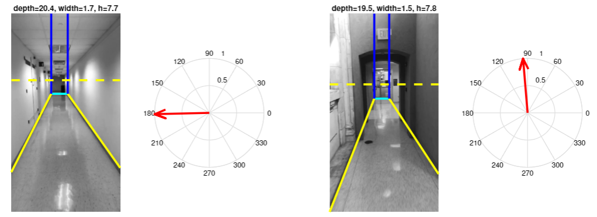

# Indoor Navigation via Vision-Inertial Data Fusion

This is the MATLAB code associated with paper [First-person indoor navigation via vision-inertial data fusion](https://ieeexplore.ieee.org/abstract/document/8373507)

 

## Sample Video 

The original video of the hallway used for experiments in the paper along with its IMU measurements collected with our iPhone App is included in `./sample_video/` directory. 

## Running Code for Hallway Video  

Run `demo_vpdetect_modular.m`

This code contains the following sections:

* Read entire video
* Read IMU data
* Synchonize IMU and video (if not)
* Apply GMM Method on each frame
* Straight line grouping
* Find alpha, beta and gamma for each frame from vanishing directions
* Kalman filter fusion of IMU and video
* Horizon line detection
* Plane detection & depth/width inference
* Step counting & finding step locations
* 2D-map generation

## Citation 
If you find our work useful in your research please consider citing our paper:
```
@inproceedings{farnoosh2018first,
  title={First-person indoor navigation via vision-inertial data fusion},
  author={Farnoosh, Amirreza and Nabian, Mohsen and Closas, Pau and Ostadabbas, Sarah},
  booktitle={Position, Location and Navigation Symposium (PLANS), 2018 IEEE/ION},
  pages={1213--1222},
  year={2018},
  organization={IEEE}
}
```
